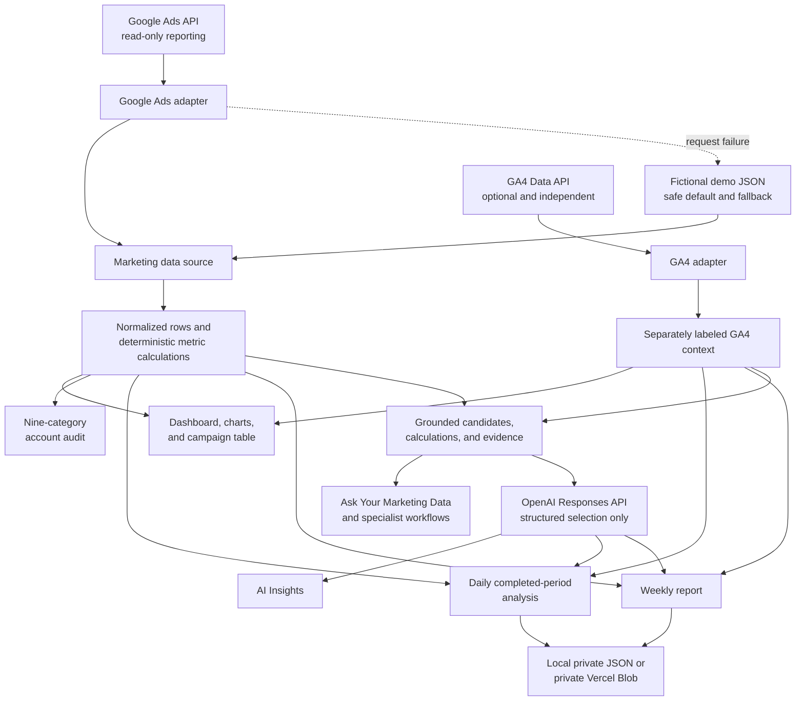

# Crush Version 1.0: AI Marketing Command Center

> **Portfolio status:** Crush is a personal learning and portfolio project built around a fictional, clearly labeled sample account. It has not been presented here as a client deployment, and no customer, revenue, or adoption claims are implied.

## Executive summary

Crush is a working marketing analytics application that brings Google Ads performance, optional GA4 context, automated analysis, account auditing, and grounded AI-assisted recommendations into one operating view.

I built it to explore a practical question from my digital marketing experience: **how can an AI interface help a marketer move from scattered metrics to defensible next actions without making up explanations?** The answer became a hybrid system. Code handles arithmetic, thresholds, source boundaries, and evidence; AI is used only where interpretation or prioritization adds value, and its output is checked against facts already calculated by the application.

The result is a portfolio project that demonstrates product thinking, marketing-domain knowledge, modern application development, API integration, and a deliberate approach to trustworthy AI. It is not a claim of production adoption or measured business impact.

<!-- After capture, insert:  -->

## The business problem

Paid-media work is rarely blocked by a lack of numbers. The harder problem is turning numbers spread across advertising and analytics platforms into a short, explainable list of decisions.

Common friction includes:

- switching between Google Ads and GA4 while remembering that they use different measurement and attribution models;
- recalculating ratios and period comparisons for recurring reviews;
- finding material issues among routine daily variation;
- producing stakeholder-ready weekly summaries without losing the supporting evidence; and
- using generative AI without allowing a confident narrative to outrun the available data.

For a small team or hands-on marketer, that work is repetitive and easy to make inconsistent.

## Product goal

The goal was to build a focused command center that helps a marketer answer three questions:

1. **What happened?** Show trustworthy KPIs, trends, campaign comparisons, and site context.
2. **What deserves attention?** Use deterministic audits and materiality rules to surface supported findings.
3. **What should I investigate next?** Provide grounded recommendations and conversational exploration while making data limitations visible.

The product is designed to be useful on first open. A fictional **Northstar Outdoor Co.** dataset provides a safe and repeatable demo; live Google Ads and GA4 connections are optional.

## Target user

The primary user is a hands-on performance marketer, marketing manager, consultant, or small-team lead who understands campaign goals but does not want to rebuild the same analysis every day and week.

Secondary audiences include marketing leaders reviewing performance and technical stakeholders evaluating how AI recommendations are grounded.

## What Crush does

| Capability | What the user gets | How it is produced |
| --- | --- | --- |
| KPI overview | Spend, conversion value, ROAS, conversions, CPA, and conversion rate | Deterministic aggregation and zero-denominator handling |
| Performance views | Daily trends plus campaign and geographic comparisons | Normalized Google Ads rows rendered with Recharts |
| GA4 context | Sessions, users, key events, sources, landing pages, and exact campaign matches | Independent GA4 Data API adapter |
| Daily analysis | Yesterday/day-before and rolling-7/prior-7 comparisons | Completed-period collection, materiality rules, optional AI selection, saved JSON |
| Weekly report | Executive summary, wins, problems, actions, evidence, and watch list | Deterministic report draft, optional AI prioritization, saved JSON |
| Account audit | Findings across nine account-health categories | Versionable rules and thresholds; no LLM required |
| AI Insights | Up to five supported paid-media recommendations | OpenAI structured output constrained to prebuilt candidates |
| Ask Your Marketing Data | Grounded answers to account questions | Deterministic intent routing, calculations, evidence packets, and bounded history |
| Specialist agents | PPC, Analytics, CRO, SEO, and strategy views | Typed scopes, deterministic routing, structured synthesis, explicit limitations |

<!-- After capture, insert:  -->

## Architecture and data flow

Crush uses the Next.js App Router. The main page is a React Server Component that loads and normalizes marketing data on the server, calculates the account view, and passes serializable results into focused interactive Client Components. Route Handlers power AI requests and saved daily/weekly workflows.

GA4 is supporting analytics context, not a substitute for Google Ads reporting. Crush displays platform-reported clicks and conversions beside site-reported sessions and key events only where useful, and joins campaign rows only when GA4 supplies an exact Google Ads campaign ID match.

## Deterministic first, AI second

The most important product decision is the separation of calculation from language generation.

**Code owns the facts.** Crush calculates metrics, comparisons, thresholds, entity matches, evidence, audit findings, and candidate recommendations before an OpenAI request is made. A missing denominator produces “unavailable,” not a misleading zero or infinity.

**AI has a bounded job.** In AI Insights, the model may select up to five prebuilt candidates through structured output. Daily and weekly automation similarly allow it to prioritize candidate IDs. It cannot author or alter metrics, entities, findings, causes, or recommendations.

**Validation is a product feature.** Zod schemas validate structured responses. Additional checks compare returned evidence to the deterministic candidate that allowed it. Unknown IDs, altered evidence, unsupported claims, or incomplete output are rejected.

**Useful fallback is part of the design.** The account audit, calculations, charts, chat, and specialist workflows do not require OpenAI. Daily and weekly processes retain deterministic output when OpenAI is absent or fails.

## Google Ads integration

The server-only Google Ads adapter uses OAuth refresh-token authentication and the REST `googleAds:searchStream` endpoint. It currently normalizes:

- account and campaign performance;
- daily metrics;
- keywords and search terms;
- geography and device performance; and
- conversion-action data.

Metrics are mapped into the same internal types used by the demo files, so dashboard, audit, chat, and insight features do not need separate live-data implementations. Live results are cached in memory for five minutes.

If `GOOGLE_ADS_DATA_SOURCE=live` is requested but configuration or the API call fails, the server logs a redacted diagnostic, the browser receives no tokens, and the UI displays a warning before falling back to the fictional sample data.

## GA4 integration

GA4 uses the official `@google-analytics/data` server library with a least-privilege service account. It loads summary metrics, key events, landing pages, traffic sources, and Google Ads campaign IDs for the configured period.

The integration is independent of the Google Ads source setting. An absent or failed GA4 connection does not prevent paid-media reporting from loading. The UI labels GA4 as connected, unconfigured, or unavailable, and explains why Ads conversions should not be expected to equal GA4 key events.

## Daily analysis

Daily Analysis works from completed calendar days in a configured IANA timezone. It compares:

- yesterday with the preceding day; and
- the rolling seven completed days with the preceding seven completed days.

Each metric must clear both an absolute materiality threshold and, where a prior non-zero value exists, a 20% relative threshold. This avoids elevating small numerical movement into a “trend.” Google Ads and GA4 can succeed or fail independently.

The analysis can run from the dashboard, `POST /api/analysis/daily`, a local npm command, or a secret-protected Vercel cron scheduled for 08:00 UTC daily. Results are date-keyed JSON: local storage for a persistent server or private Vercel Blob in a Vercel deployment.

<!-- After capture, insert:  -->

## Weekly reporting

The Weekly Marketing Report compares the latest seven completed days with the preceding seven. It produces a consistent executive summary, source-labeled KPI changes, wins, problems, recommended actions, supporting evidence, and a next-week watch list.

The report is complete before optional AI prioritization. Every narrative item refers to deterministic evidence IDs, and the persisted Zod schema rejects unknown references. A model or source failure is recorded rather than hidden.

Users can generate and retrieve reports through the dashboard and Route Handlers, run the workflow from the command line, or use the protected Monday 09:00 UTC cron. Email and Slack delivery are not implemented and remain future work.

<!-- After capture, insert:  -->

## Account audit

The audit evaluates nine categories without an LLM:

1. account performance;
2. campaign performance;
3. keyword performance;
4. search-term waste;
5. budget efficiency;
6. conversion tracking;
7. device performance;
8. geographic performance; and
9. landing-page performance.

Each finding carries a severity, affected entity, evidence, rule ID, and recommendation. A section can explicitly report unavailable or insufficient data rather than awarding a clean bill of health when inputs are missing.

<!-- After capture, insert:  -->

## AI Insights

The AI Insights panel is the explicitly generative part of the interactive dashboard. The application prepares paid-media candidates across campaigns, geography, devices, keywords, search terms, conversions, and any exact-match GA4 context. OpenAI's `gpt-4o-mini` model is called through the Responses API with a strict Zod output format and storage disabled.

The returned recommendation is displayed only if its entity, severity, wording, action, expected impact, and evidence match one allowed candidate. This makes the model a constrained prioritization layer over application-owned facts.

<!-- After capture, insert:  -->

## Ask Your Marketing Data

The conversational interface handles questions such as best campaigns, wasted spend, city conversion rate, budget opportunities, negative-search-term review, and direct metric calculations. It supports bounded recent history for follow-up questions.

This path is intentionally deterministic and does **not** call OpenAI. Questions are validated, routed to supported calculation or evidence packets, and answered with cited metrics and limitations. Unsupported questions receive an honest insufficient-data response instead of an improvised answer.

<!-- After capture, insert:  -->

## Specialist marketing agents

The specialist selector includes Auto, PPC Analyst, Analytics Analyst, CRO Analyst, SEO Analyst, and Marketing Strategist / CMO.

These are typed analytical roles, not autonomous external actors. Each role has an explicit scope and evidence boundary:

- PPC works from loaded Google Ads and exact-match paid context.
- Analytics works from available GA4 facts and refuses unsupported period comparisons.
- CRO separates measured landing-page outcomes from hypotheses that require experiments.
- SEO can describe available organic GA4 context but cannot claim Search Console, ranking, crawl, or backlink findings.
- The strategist combines validated specialist outputs and ranks at most three supported actions.

Auto routing uses deterministic domain signals. Broad or cross-channel questions invoke a bounded two-stage specialists-to-strategist synthesis; there is no recursive agent loop, model tool calling, RAG, MCP dependency, or persistent agent memory in the current implementation.

<!-- After capture, insert:  -->

## Technologies used

| Layer | Technology | Role in Crush |
| --- | --- | --- |
| Application | Next.js 16.3.3 App Router, React 19.2.8 | Server-rendered data workspace plus interactive client panels |
| Language | TypeScript 5 | Shared domain types, strict calculation and API contracts |
| Interface | Tailwind CSS 4, Recharts 3.10.1 | Responsive dashboard and data visualization |
| AI | OpenAI Node SDK 7.x, Responses API, `gpt-4o-mini` | Constrained structured selection and prioritization |
| Validation | Zod 4.4.3 | Request, model-output, specialist, and persisted-report schemas |
| Marketing data | Google Ads REST API, Google Analytics Data API | Read-only advertising and site analytics inputs |
| Persistence | Node file system, private Vercel Blob | Date-keyed daily analyses and weekly reports |
| Scheduling | Vercel Cron | Secret-protected daily and weekly triggers |
| Quality | ESLint plus repository verification scripts | Build, lint, deterministic calculations, adapters, grounding, and workflows |

## Security and credential handling

- API keys, OAuth credentials, customer IDs, GA4 service-account details, Blob tokens, and cron secrets are server-only environment variables with no `NEXT_PUBLIC_` prefix.
- Integration modules use `server-only` boundaries so accidental client imports fail during development/build.
- Google Ads access is reporting-only in this implementation; Crush does not mutate campaigns.
- Live Google Ads diagnostics are redacted and logged server-side; the browser receives a safe warning.
- OpenAI requests set `store: false`.
- Cron routes require `Authorization: Bearer <CRON_SECRET>` and return metadata rather than detailed marketing data.
- Vercel persistence uses private Blob access. Local files are created with owner-only permissions where supported and written through a temporary-file rename.

This is a sound portfolio-project posture for Version 1.0, not a completed enterprise security review. User authentication, tenancy, consent/retention controls, secret rotation operations, and formal threat modeling would be required before handling multiple real client accounts.

## Demo data and graceful fallback

The default experience is an intentional portfolio mode, not a broken integration. Bundled JSON represents the fictional Northstar Outdoor Co. account for August 18–24, 2025. The header and source labels say “Demo data,” so a reviewer can explore the product without credentials.

Fallbacks preserve trust:

- failed live Google Ads reads fall back to labeled demo data;
- missing or failed GA4 leaves paid-media features intact;
- absent OpenAI configuration does not block deterministic features;
- AI failures do not erase deterministic daily or weekly output; and
- sample rows are not silently relabeled as a current automation period.

## Key challenges and solutions

| Challenge | Solution implemented |
| --- | --- |
| Avoiding hallucinated marketing advice | Precompute candidate findings and verify structured AI output against the matching candidate |
| Keeping Ads and GA4 conceptually honest | Label sources separately, exact-match campaign IDs, and prohibit attribution reconciliation or causal claims |
| Making a portfolio demo reliable | Ship a fictional dataset, visible mode labels, and graceful integration fallbacks |
| Preventing noisy daily alerts | Require absolute and relative materiality thresholds over completed periods |
| Handling missing or zero data | Model unavailable states explicitly instead of coercing them to zero |
| Preserving report traceability | Link every weekly narrative item to deterministic evidence IDs and validate before saving |
| Scheduling on ephemeral infrastructure | Separate orchestration from HTTP and use private Vercel Blob for durable deployed storage |
| Keeping “agents” within known evidence | Give each role a typed scope, surface limitations, and use a bounded non-recursive synthesis workflow |

## Results and lessons learned

The project result is a coherent, demonstrable application—not a measured client outcome. It can show an employer or potential client how I combine hands-on digital marketing judgment with AI-assisted software development and careful data-product design.

What I learned:

- Trustworthy AI often depends more on the surrounding deterministic system than on a more elaborate prompt.
- “Insufficient data” is a useful product result when it is specific and actionable.
- Marketing integrations need explicit measurement boundaries; similar-looking metrics are not automatically comparable.
- A useful demo needs realistic failure behavior, not just a happy path.
- Domain knowledge helps define better software contracts: materiality thresholds, attribution caveats, conditional negatives, and hypothesis labels all came from treating marketing decisions as more than generic data summaries.
- Small, testable workflows were more appropriate here than autonomous agents or a retrieval layer.

No claims are made about customers, conversion lift, savings, revenue impact, or production adoption because those outcomes have not been established for this personal project.

## What I would build next

The items below are near-term foundations. See the [post-V1 future roadmap](future-roadmap.md) for the complete phased integrations, intelligence, generation, controlled-action, and agency backlog.

1. Harden the public demo and add authenticated, isolated workspaces for connected accounts.
2. Add consent, retention, deletion, audit-log, and secret-rotation controls for real client data.
3. Add configurable goals and business context—targets, margins, lead quality, and approved conversion definitions—without weakening evidence boundaries.
4. Add notification adapters for saved daily/weekly output, beginning with email or Slack review workflows.
5. Add GA4 prior-period views to more dashboard and specialist paths.
6. Integrate Search Console before expanding SEO conclusions.
7. Add browser-level end-to-end tests and observability for scheduled runs and integration health.
8. Test recommendations with real users and measure usefulness, accuracy, and time-to-decision before claiming product impact.

## Screenshots

No screenshots are committed yet. The exact eight-image capture plan and filenames are in [the screenshot checklist](screenshots/README.md). The commented image lines in this case study show where the strongest images can be inserted without broken placeholders today.

## Links

- **GitHub:** [github.com/davibus/crush](https://github.com/davibus/crush)
- **Live demo:** [crush-gamma-sage.vercel.app](https://crush-gamma-sage.vercel.app)
- **Demo video:** **TODO — record and publish the 2–3 minute walkthrough**
- **Demo script:** [docs/demo-script.md](demo-script.md)
- **Screenshot checklist:** [docs/screenshots/README.md](screenshots/README.md)
- **Portfolio/resume copy:** [docs/portfolio-entry.md](portfolio-entry.md)
- **Technical setup:** [README.md](../README.md)
